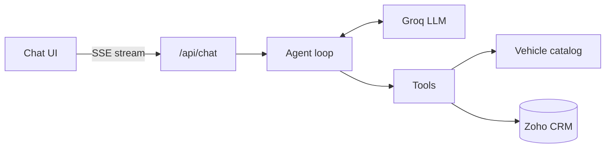

# auto-crm-ai-agent

An AI chat agent for a car maker, connected live to Zoho CRM.

It figures out where the customer is in their journey (new enquiry, ongoing deal, booked vehicle or service), answers their questions, and saves leads, follow-ups and service cases straight to Zoho. Customers can switch topics at any point in the chat.

Built with Next.js, Groq (LLM with tool calling) and the Zoho CRM REST API.

## What it can do

| Stage | Customer asks about | Agent does | Zoho action |
|---|---|---|---|
| **New Lead** | Models, variants, prices, features | Answers from the vehicle catalog, offers a test drive, collects name, phone, email and city, then creates a lead | Create Lead |
| **Ongoing Pipeline** | Test drive, quotation, dealer | Finds the deal by phone or deal ID, shares its status and saves a follow-up preference | Search and update Deal |
| **Booked Vehicle** | Delivery, VIN, balance payment | Finds the booking by booking ID or phone and shares allocation status, VIN, delivery date and balance (with a payment link) | Search Deals |
| **Service** | Service booking or complaint | Finds the owner by phone (or registers them), collects vehicle and issue details, then creates a service case | Search/create Contact, create Case |

## How it works



For each message, the agent loop sends the chat to the LLM, runs any tools it asks for, and feeds the results back. This repeats (up to 5 rounds) until the LLM gives a final answer, which is streamed to the UI.

## Project structure

```
app/
  api/chat/route.ts   Chat endpoint (streams replies, DELETE resets the session)
  page.tsx            Chat UI
lib/
  agent/              Agent loop, tools, system prompt, Groq client
  zoho.ts             Zoho auth and API requests
  crm.ts              Leads, Contacts, Deals and Cases operations
  catalog.ts          Vehicle lookup
  dealers.ts          Dealer lookup by city
  validation.ts       Phone, email, booking ID and other input checks
  session.ts          In-memory chat sessions
data/
  vehicles.json       XUV700, Thar and Scorpio-N variants, prices, features
  dealers.json        Demo dealers by city
scripts/
  seed.ts             Creates demo CRM records
  test-zoho.ts        Checks the Zoho connection and setup
```

## Setup

You need **Node.js 20.9 or later**, a Zoho CRM account (India data center) and a Groq account.

### 1. Add custom fields in Zoho CRM

Create these fields (single-line text unless noted):

- **Leads:** Vehicle Model, Preferred City
- **Deals:** Vehicle Model, Booking ID, Allocation Status, Test Drive Time, Follow Up Preference, VIN, Expected Delivery (date), Balance Amount (currency)
- **Cases:** Registration No, Odometer, Service Center

Optional: for short case numbers like `CS-1001`, go to Setup > Customization > Modules and Fields > Cases, edit the Case Number field and set a prefix.

### 2. Get a Zoho refresh token

1. At https://api-console.zoho.in, add a **Self Client** and copy its client ID and secret.
2. Under **Generate Code**, enter the scope `ZohoCRM.modules.ALL,ZohoCRM.settings.fields.READ` and generate a code.
3. Swap the code for a refresh token (do this quickly, the code expires):

   ```bash
   curl -X POST https://accounts.zoho.in/oauth/v2/token \
     -d grant_type=authorization_code \
     -d client_id=YOUR_CLIENT_ID \
     -d client_secret=YOUR_CLIENT_SECRET \
     -d code=YOUR_GRANT_CODE
   ```

   Copy `refresh_token` from the response.

### 3. Get a Groq API key

Create one at https://console.groq.com/keys.

### 4. Create `.env`

In the project root:

```env
ZOHO_CLIENT_ID=...
ZOHO_CLIENT_SECRET=...
ZOHO_REFRESH_TOKEN=...
GROQ_API_KEY=...
GROQ_MODELS=...
```

Optional variables:

| Variable | Default |
|---|---|
| `ZOHO_ACCOUNTS_URL` | `https://accounts.zoho.in` |
| `ZOHO_API_DOMAIN` | `https://www.zohoapis.in` |
| `GROQ_MODELS` | `openai/gpt-oss-120b,openai/gpt-oss-20b,qwen/qwen3.8-27b` (fallback order) |
| `GROQ_MODEL` | Model to try first, ahead of the list above |

### 5. Install and run

```bash
npm install
npm run zoho:test   # checks the Zoho connection and custom fields
npm run seed        # adds demo records (safe to run again)
npm run dev         # open http://localhost:3000
```

Other scripts: `npm run typecheck`, `npm run build`, `npm start`.

## Demo data

Use these phone numbers to try each stage:

| Phone | Customer | Try |
|---|---|---|
| 9876500001 | Rajesh Sharma | Existing lead (Thar, Mumbai) |
| 9876500002 | Priya Patel | Ongoing deal: XUV700, test drive on 30 Sep 2026, 11:00 AM |
| 9876500003 | Vikram Mehta | Booked Scorpio-N Z8L: booking MAH-9921, In Transit, delivery 10 Oct 2026, ₹16,00,000 due |
| 9876500004 | Amit Verma | Service request |

Any other number works as a new customer.

## Example chat

> **User:** Hi, I'm interested in the XUV700 AX7. What does it cost and does it get ADAS?
> **Agent:** The XUV700 AX7 costs ₹19.49 to ₹23.69 lakh ex-showroom and comes with Level 2 ADAS. Would you like a test drive? Could you share your name and mobile number?
> **User:** I'm Neha Kapoor, 98123 45670, neha.kapoor@example.com, Pune
> **Agent:** Name: Neha Kapoor, Mobile: 9812345670, Email: neha.kapoor@example.com, Vehicle: XUV700 AX7, City: Pune. Shall I go ahead?
> **User:** Yes
> **Agent:** *(Creating lead)* Your test drive request has been recorded. A dealership in Pune will contact you shortly.

## Key design choices

- **No made-up answers.** Vehicle facts come only from the catalog, and customer details only from Zoho. Missing values are reported as not yet available.
- **Confirm before saving.** Before creating a lead, contact or service case, the agent shows a summary and waits for the customer to say yes. If the reply is just "yes", the server saves it directly.
- **No false "saved" messages.** If the agent says something was saved but no save actually happened, the reply is withdrawn and corrected.
- **Safe writes.** The agent can only update records it looked up earlier in the same chat. An existing lead gets a note instead of a duplicate.
- **Input checks.** Phone numbers, emails, booking IDs, registration numbers and odometer readings are validated. On bad input the agent asks again.
- **No dead ends.** When a record isn't found, the agent suggests a next step (recheck the number, use a booking ID, start a new enquiry, or register).
- **Private data stays private.** Dealer contacts come from `data/dealers.json`, never from internal CRM users.
- **Model fallback.** If a Groq model hits its rate limit, the agent switches to the next model in the list.
- **Zoho tokens.** Access tokens are cached and refreshed automatically before they expire.

