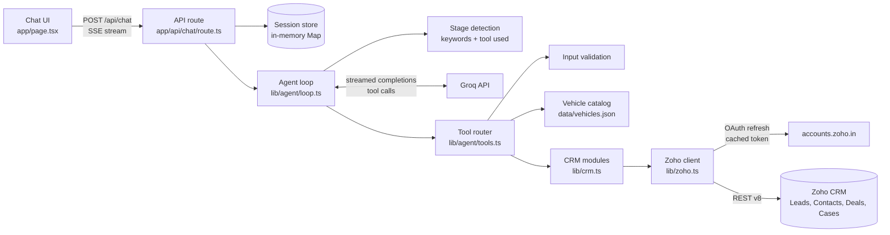

# auto-crm-ai-agent

Multistage AI chat agent for an automotive OEM with LLM tool calling and live Zoho CRM integration across leads, deals, bookings and service.

The agent detects where a customer is in the lifecycle, answers from a local vehicle catalog or the CRM, and writes back to Zoho CRM (Leads, Deals, Cases) in real time. Customers can switch topics mid-conversation.

## Customer stages

| Stage | Customer intent | What the agent does | Zoho |
|---|---|---|---|
| New Lead | Models, variants, prices, features | Answers from `data/vehicles.json`, offers a test drive, collects name, phone, email and city, confirms, creates the lead | Create Lead |
| Ongoing Pipeline | Test drive confirmation, quotation, dealer contact | Finds the deal by phone or deal ID, reports stage, test drive time, quotation and dealer, saves follow-up preference | Search Contacts/Deals, update Deal |
| Booked Vehicle | Delivery, allocation, balance payment | Finds the Closed Won deal by booking ID or phone and reports Allocation Status | Search Deals |
| Service | Service booking or complaint | Finds the owner by phone (registers them as a new contact if not found), collects registration no, odometer, issue, service type and service center, confirms, creates the case and shares its case number | Search/create Contact, create Case |

## Architecture



Each user message runs through the loop: LLM, tool calls, tool results back to the LLM, up to 5 rounds until a final answer. The route streams `stage`, `tool_start`, `tool_end`, `text`, `done` and `error` events to the UI.

## Project structure

```
app/
  api/chat/route.ts    SSE chat endpoint (POST) and session reset (DELETE)
  page.tsx             Chat UI
  page.module.css
lib/
  zoho.ts              OAuth token cache, authenticated requests, 401 retry, 204 handling
  crm.ts               Leads, Contacts, Deals, Cases operations
  catalog.ts           Vehicle catalog lookup
  validation.ts        Phone, email, booking ID, registration no, odometer validators
  session.ts           In-memory sessions
  agent/
    tools.ts           Tool schemas and handlers
    prompt.ts          System prompt
    loop.ts            Stage detection and tool-calling loop
data/vehicles.json     XUV700, Thar, Scorpio-N variants, prices and features
scripts/
  seed.ts              Creates the demo CRM records if missing
  test-zoho.ts         Smoke test against the live CRM
```

## Setup

Requires Node.js 20.6 or later.

### 1. Zoho CRM

1. In Zoho CRM (India data center), create these single-line custom fields:
   - Leads: Vehicle Model, Preferred City
   - Deals: Vehicle Model, Booking ID, Allocation Status, Test Drive Time, Follow Up Preference
   - Cases: Registration No, Odometer, Service Center

   To give customers short case numbers such as `CS-1001`, open Setup > Customization > Modules and Fields > Cases, edit the Case Number field and set a prefix and starting number. Without this, Zoho generates long numeric case numbers.
2. Open https://api-console.zoho.in, add a **Self Client**, and note the client ID and secret.
3. Under **Generate Code**, use the scope `ZohoCRM.modules.ALL,ZohoCRM.settings.fields.READ` and generate a grant code.
4. Exchange the grant code for a refresh token within its validity window:

   ```bash
   curl -X POST https://accounts.zoho.in/oauth/v2/token \
     -d grant_type=authorization_code \
     -d client_id=YOUR_CLIENT_ID \
     -d client_secret=YOUR_CLIENT_SECRET \
     -d code=YOUR_GRANT_CODE
   ```

   Copy `refresh_token` from the response.

### 2. Groq

Create an API key at https://console.groq.com/keys.

### 3. Environment

```bash
cp .env.example .env
```

| Variable | Description |
|---|---|
| `ZOHO_CLIENT_ID`, `ZOHO_CLIENT_SECRET` | Self Client credentials |
| `ZOHO_REFRESH_TOKEN` | Refresh token from step 1.4 |
| `ZOHO_ACCOUNTS_URL` | `https://accounts.zoho.in` |
| `ZOHO_API_DOMAIN` | `https://www.zohoapis.in` |
| `GROQ_API_KEY` | Groq API key |
| `GROQ_MODEL` | Optional, defaults to `openai/gpt-oss-120b` |

### 4. Install, verify, seed and run

```bash
npm install
npm run zoho:test   # token refresh, 401 retry, field check, search, create and delete a lead
npm run seed        # idempotent: creates only missing demo records
npm run dev         # http://localhost:3000
```

Other scripts: `npm run typecheck`, `npm run build`, `npm start`.

## Demo data

| Record | Phone | Details |
|---|---|---|
| Lead: Rajesh Sharma | 9876500001 | Thar, Mumbai |
| Contact + Deal: Priya Patel | 9876500002 | "Priya Patel - XUV700", Qualification, test drive 30 Sep 2026, 11:00 AM |
| Contact + Deal: Vikram Mehta | 9876543210 | "Vikram Mehta - Scorpio-N Z8L", Closed Won, booking MAH-9921, In Transit |
| Contact: Amit Verma | 9876543201 | Service case demo |

## Sample conversations

These are from test runs against the live CRM; replies are shortened.

**New Lead**

> **User:** Hi, I'm interested in the XUV700 AX7. What does it cost and does it get ADAS?
> **Agent:** The XUV700 AX7 is priced between ₹19.49 lakh and ₹23.69 lakh ex-showroom and comes with Level 2 ADAS. Would you like to schedule a test drive? Could you share your full name and mobile number?
> **User:** Yes. I'm Neha Kapoor, my number is 98123 45670
> **Agent:** Great, Neha. Could you also share your email address and the city for the test drive?
> **User:** neha.kapoor@example.com, and Pune
> **Agent:** Name: Neha Kapoor, Mobile: 9812345670, Email: neha.kapoor@example.com, Vehicle: XUV700 AX7, City: Pune. Shall I go ahead?
> **User:** Yes, go ahead
> **Agent:** *(Creating lead)* Your test drive request has been recorded. A dealership in Pune will contact you shortly.

**Ongoing Pipeline**

> **User:** Is my test drive confirmed? Also what quotation did I get? My number is 9876500002
> **Agent:** *(Searching deals)* Your test drive is scheduled for 30 September 2026 at 11:00 AM, and your quotation is ₹22,00,000. Would you like to set a preferred follow-up channel or time?
> **User:** WhatsApp on weekday evenings after 6 pm. Who is my dealer contact?
> **Agent:** *(Updating follow-up preference)* Your follow-up preference is saved as WhatsApp, weekday evenings after 6 pm. Your dealer contact is Rohit Singh.

**Booked Vehicle**

> **User:** When will my Scorpio-N be delivered? Booking ID is MAH-12
> **Agent:** That booking ID doesn't match our format (MAH- followed by 4 to 6 digits, e.g. MAH-9921). Could you share the correct ID or your registered mobile number?
> **User:** My phone is 9876543210. Has the VIN been allocated and how much balance do I need to pay?
> **Agent:** *(Checking booking status)* Your booking MAH-9921 for the Scorpio-N Z8L is In Transit: the vehicle has left the plant and is on its way to the dealership. VIN, delivery date and balance amount are not recorded in our system; your dealer Rohit Singh can share them.

**Stage switch to Service**

> **User:** What's the ground clearance of the Thar?
> **Agent:** The Thar offers 226 mm of ground clearance. Would you like to schedule a test drive?
> **User:** Actually I already own a Thar and the clutch is giving trouble. My number is 9876543201
> **Agent:** *(Looking up customer)* Could you share your registration number and current odometer reading?
> **User:** Registration is MH 12 KT 4521 and it has done 18,400 km
> **Agent:** Which service center would you prefer?
> **User:** Wakad service center in Pune. The clutch pedal feels hard and there's a grinding noise while shifting.
> **Agent:** Registration MH 12 KT 4521, 18,400 km, clutch issue, Wakad, Pune. Please confirm.
> **User:** Yes, that's correct
> **Agent:** *(Creating service request)* Your service case has been created with status New. The workshop will contact you to schedule an appointment.

**Service for an owner not yet in the CRM**

> **User:** My XUV700's AC is not cooling, I want to book a service. My number is 9811199988
> **Agent:** *(Looking up customer)* I couldn't find 9811199988 in our system. Could you confirm the number is correct?
> **User:** Yes, 98111 99988 is correct. I'm Sanjay Rao, sanjay.rao@example.com
> **Agent:** Name: Sanjay Rao, Mobile: 9811199988, Email: sanjay.rao@example.com. May I register you with these details?
> **User:** Yes please
> **Agent:** *(Registering customer)* You're registered. Could you share your registration number and odometer reading?

## Design notes

- **Grounded answers.** Vehicle facts come only from the catalog and customer data only from tool results. Booking results state explicitly what the CRM does not hold (VIN, delivery date, balance payment) so the model has nothing to fill in.
- **Validation.** Tools validate and normalise input (Indian mobile numbers with or without +91, email, `MAH-1234` booking IDs, registration numbers including BH series, odometer). Failures return `invalid_input` with the field and a reason so the model asks again.
- **No dead ends.** Every not-found result carries a `next_step`. The first miss on a phone number asks the customer to recheck it; a repeat miss moves on: asking for a deal or booking ID, offering a new enquiry, or registering a new contact in the service flow.
- **Write safeguards.** `update_deal_followup` and `create_service_case` only accept deal and contact IDs returned by a lookup earlier in the same session, and `create_contact` only accepts a phone number that was searched and not found. Leads are de-duplicated by phone, and repeated create calls within a session return the existing record. The prompt requires an explicit confirmation before any create.
- **Zoho token handling.** The access token is cached in memory and refreshed 5 minutes before expiry; concurrent requests share one refresh; a 401 triggers one refresh and retry. HTTP 204 from search is treated as not found.
- **Session state.** An in-memory Map keyed by session ID holds history, detected stage, collected details and verified CRM IDs. Sessions expire after 2 hours of inactivity. Only user messages and final replies are kept across turns; facts needed later (customer name, phone, deal, contact and booking IDs) are carried in the system prompt as known details.
- **Stage detection.** A keyword pass gives the UI an immediate stage; the stage of any tool the model calls then confirms or corrects it.
- **Errors.** Zoho failures reach the model as `crm_unavailable`. Groq failures reach the user as a friendly message with a Retry button; a failed turn is not saved, so retrying is safe.

## Notes and limitations

- **Model.** `llama-3.3-70b-versatile` is no longer available on Groq, so the default is `openai/gpt-oss-120b` with native tool calling. Set `GROQ_MODEL` to use another tool-capable model.
- **Rate limits.** Groq's free tier allows 8,000 tokens per minute. Several tool-heavy turns in quick succession can hit it; the user sees a retry message. A paid tier removes this.
- **Sessions** are held in process memory, so they reset on restart and are not shared across instances. Swap `lib/session.ts` for Redis or a database to scale out.
- Vehicle prices are indicative ex-showroom figures for demo purposes.
